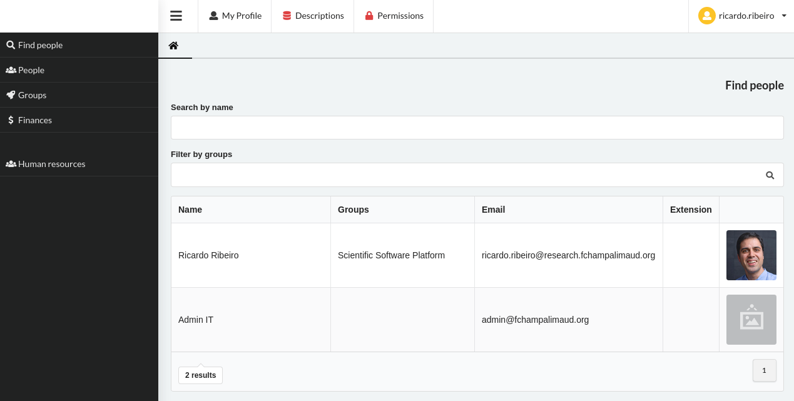

.. Research CORE documentation master file, created by
   sphinx-quickstart on Wed Aug 14 16:38:18 2019.
   You can adapt this file completely to your liking, but it should at least
   contain the root `toctree` directive

Research CORE
=========================================

.. toctree::
   :maxdepth: 4
   :caption: Contents:

   install

Indices and tables
==================

* :ref:`genindex`
* :ref:`modindex`
* :ref:`search`
